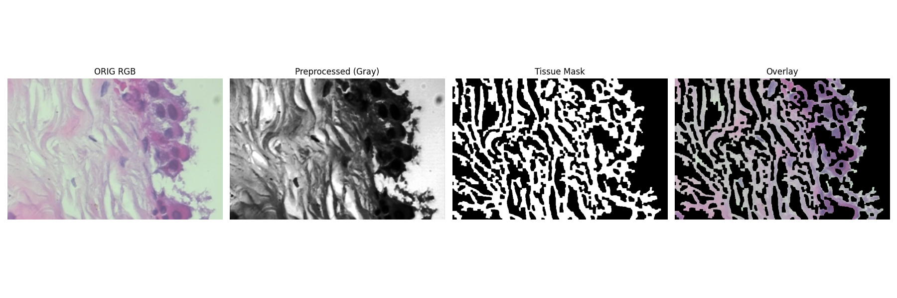
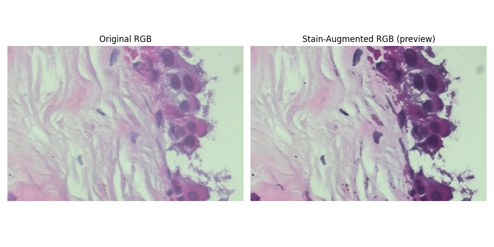

# Histopath Pipeline — Digital Pathology Preprocessing & Stain Augmentation

This pipeline provides an end-to-end preprocessing and segmentation workflow for digital pathology images such as H&E-stained histology slides. It performs realistic stain perturbation augmentation, grayscale preprocessing, and adaptive or Otsu tissue segmentation.

---

## Overview 

1. Load RGB images.
2. Optionally augment stains using HistomicsTK to simulate realistic color variation.  
3. Preprocess images → convert to grayscale, apply Gaussian blur, and optionally perform histogram equalization.  
4. Segment tissue using adaptive or Otsu thresholding to distinguish tissue from background.  
5. Post-process masks using morphological operations to clean up small gaps and noise.  
6. Save artifacts for each original and augmented image:  
   - Grayscale image  
   - Binary tissue mask (white = tissue, black = background)  
   - Overlay (mask × RGB)  
   - Augmented variants (if enabled)


- Each stage of the workflow (preprocessing, segmentation, visualization, augmentation) is encapsulated in its own class, making it easy to maintain or extend individual components without affecting others.
- Core classes such as `ImagePreprocessor`, `TissueSegmenter`, and `StainAugmenter` can be reused across experiments, notebooks, or larger frameworks without code duplication.
- Parameters are passed through dataclass-based configurations (`PreprocessConfig`, `PipelineConfig`), allowing clean control over pipeline behavior from the CLI or other scripts.
- The `TissuePipeline` class orchestrates all modules, making it simple to run the entire workflow on single images or directories with minimal setup.
- The modular architecture supports easy integration of new preprocessing methods, segmentation algorithms, or post-processing steps in future versions.

---

## Dependencies

Install all required packages:

```bash
pip install histomicstk opencv-python matplotlib numpy
```

Libraries used:
- [HistomicsTK](https://digitalslidearchive.github.io/HistomicsTK/): provides `rgb_perturb_stain_concentration` for realistic stain perturbations.  
- OpenCV (cv2): handles image I/O, color conversion, Gaussian blurring, thresholding, contour extraction, and overlay generation.  
- Matplotlib: for visualization and figure export.  
- NumPy: for fast array and numerical operations.

---

## Processing Workflow

For each input image, the pipeline performs the following:

| Step | Description | Output |
|------|--------------|---------|
| 1 | Load | Read input RGB image → `*_rgb.png` |
| 2 | Preprocess | Convert to grayscale → blur → (optional) equalize → `*_gray.png` |
| 3 | Segment | Adaptive or Otsu threshold → binary tissue mask → `*_mask.png` |
| 4 | Overlay | Apply mask to RGB image → `*_overlay.png` |
| 5 | (Optional) Stain Augmentation | Generate `n_aug` color-perturbed versions via HistomicsTK → `*_rgb_augN.png` |
| 6 | Repeat steps 2–4 for each augmented image | Grayscale, mask, and overlay for every augmented version → `*_gray_augN.png`, `*_mask_augN.png`, `*_overlay_augN.png` |

Final binary masks:  
- `*_mask.png` — segmentation of the original image  
- `*_mask_augN.png` — segmentation of each stain-augmented variant  
Each mask is a binary `uint8` image (0 = background, 255 = tissue).

---

## Example Outputs

Example visualizations are stored in `images/`:

| Description | Image |
|--------------|-------|
| Local threshold result |  |
| Stain-augmented RGBs |  |

---

### Stain Augmentation & Adaptive Thresholding

Histopathology images often vary in color and intensity due to differences in slide preparation, staining, reagents, scanners, or illumination.  
To address this, the pipeline applies stain augmentation to simulate realistic color variation, improving model robustness and generalization.  

For segmentation, adaptive thresholding is used instead of a single global cutoff. It dynamically adjusts to local intensity differences, making tissue extraction more reliable under uneven staining or lighting conditions.


---

## Command-line Usage

### Process a single image

```bash
cd histopath-pipeline-demo

python -m histopath_pipeline.tissue_pipeline     --image '/path/to/SOB_B_A-14-22549AB-400-001.png'     --n_stain_aug 3     --save_dir './output'     --show
```

### Process a directory

```bash
python -m histopath_pipeline.tissue_pipeline     --dir '/path/to/patches'     --n_stain_aug 5     --save_dir './output'
```
