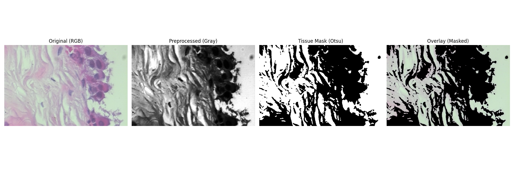

# Histopath Pipeline Demo

This project provides a simple, modular pipeline for **histopathology image preprocessing and segmentation**.  
It demonstrates an object-oriented approach using OpenCV and Matplotlib for digital pathology workflows such as grayscale conversion, denoising, tissue masking, and visualization.

---

## Overview

The pipeline is organized into a few main components:

- **ImagePreprocessor** – converts images to grayscale, applies Gaussian denoising, and enhances contrast.  
- **TissueSegmenter** – performs tissue segmentation using Otsu thresholding and contour detection.  
- **Visualizer** – displays results side by side for easy comparison.  
- **TissuePipeline** – orchestrates preprocessing, segmentation, visualization, and optional saving of results.

You can run the pipeline on a **single image**, a **directory**, or **sample random images** from a dataset.

---

## Installation

```bash
git clone https://github.com/<your-username>/histopath-pipeline-demo.git
cd histopath-pipeline-demo
pip install -r requirements.txt
```

Minimal requirements:
```
opencv-python
matplotlib
numpy
```

---

## Usage

### Single Image
```bash
python -m histopath_pipeline.tissue_pipeline \
  --image path/to/image.png \
  --show
```

### Directory of Images
```bash
python -m histopath_pipeline.tissue_pipeline \
  --dir path/to/folder \
  --show
```

### One Chosen Image + 4 Random Samples
```bash
python -m histopath_pipeline.tissue_pipeline \
  --image path/to/chosen.png \
  --sample_from path/to/folder \
  --sample_n 4 \
  --show
```

You can also specify:
- `--save_dir` to store results
- `--blur_ksize` and `--blur_sigma` to adjust Gaussian blur
- `--no_equalize` to disable histogram equalization

---

## Example Output

Below is an example output visualization from the pipeline, showing the original image, preprocessed grayscale, binary tissue mask (Otsu), and overlay:

<p align="center">
  
</p>

---

## Project Structure
```
histopath_pipeline/
├── __init__.py
├── helpers.py
├── tissue_pipeline.py
images/
└── otsu.png
.gitignore
```

---

## Next Steps
- Try different preprocessing parameters (`--blur_ksize`, `--blur_sigma`).
- Extend the pipeline with new segmentation or classification models.
- Integrate with annotation tools or patch extraction workflows for larger datasets.
